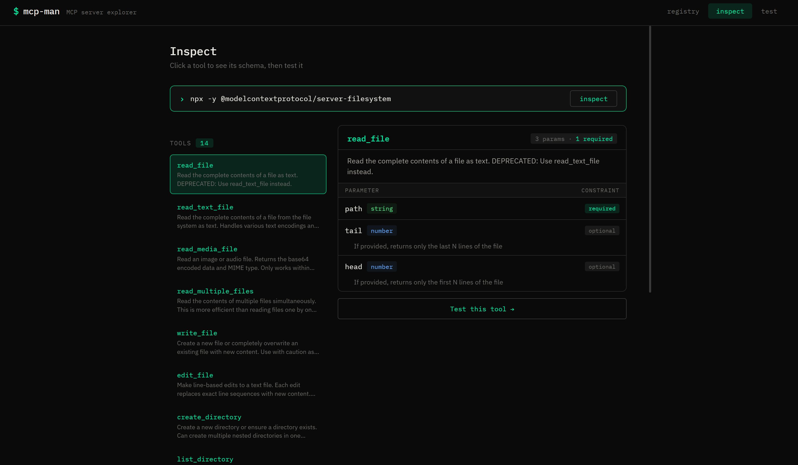
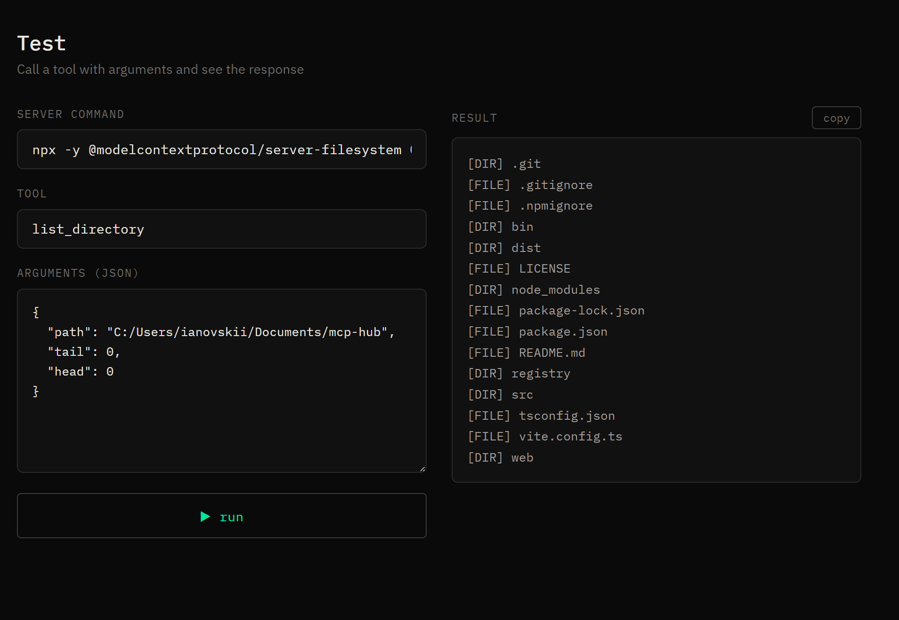

[](https://www.npmjs.com/package/@aaglexx/mcp-man)
[](https://www.npmjs.com/package/@aaglexx/mcp-man)
[](./LICENSE)
[](https://safeskill.dev/scan/aaglexx-mcp-man)

# mcp-man

**Postman for MCP.** Search 156 servers, inspect their tools, test them live — all from the browser.

```bash
npm install -g @aaglexx/mcp-man
mcp-man ui
```




---

## The problem

There are hundreds of MCP servers. But to know what any of them actually does, you have to dig through GitHub READMEs, guess at parameters, and figure out which env vars it needs. Every time.

`mcp-man` fixes that. Connect to any MCP server and instantly see every tool, its full schema, required params, and types. Then call it with one click.

---

## What's inside

| | |
|---|---|
| **Registry** | 156 servers, searchable by name or tag |
| **Inspect** | Connect to any server, browse tools with full schema visualizer |
| **Test** | Call any tool live with JSON args, see the raw response |
| **Auth wizard** | Guided API key setup for 78 servers — with direct links to get each token |
| **CLI** | Everything available from the terminal too |

---

## Get started

```bash
# No auth needed — works instantly
npx -y @modelcontextprotocol/server-memory
npx -y @modelcontextprotocol/server-filesystem /your/path

# Needs a token — wizard will guide you
github-mcp-server              → GITHUB_PERSONAL_ACCESS_TOKEN
@notionhq/notion-mcp-server    → Notion integration token
```

Just paste any command into the Inspect field and hit go.

---

## CLI

```bash
mcp-man search github
mcp-man search --tag database
mcp-man inspect "npx -y @modelcontextprotocol/server-memory"
mcp-man test read_graph --server "npx -y @modelcontextprotocol/server-memory"
```

---

## Add your server

Edit [`registry/servers.json`](./registry/servers.json) and open a PR:

```json
{
  "name": "@you/your-mcp-server",
  "description": "One line about what it does",
  "url": "https://github.com/you/your-server",
  "tags": ["your", "tags"],
  "author": "Your Name",
  "license": "MIT"
}
```

If your server needs credentials, add an `env` array — the auth wizard will pick it up automatically.

---

## Dev setup

```bash
git clone https://github.com/aaglexx/mcp-man && cd mcp-man && npm install

# Terminal 1
npm run dev:cli -- ui --dev

# Terminal 2
npm run dev:web
```

---

## Roadmap

- [x] Registry with 156 servers
- [x] Schema visualizer
- [x] Auth wizard for 78 servers
- [ ] Sandboxed runner — no local install needed
- [ ] Health badge per server

---

MIT
